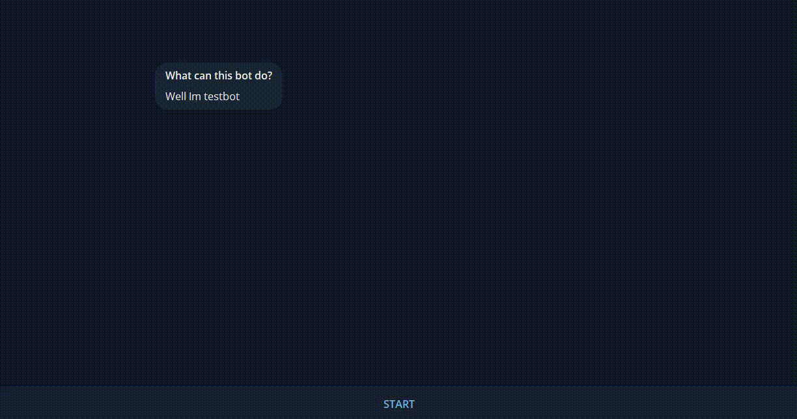

# Simple Telegram Bot

This bot is designed to assist users with a plethora of functionalities, from checking the date and calendar on the server 📅 to playing games with random values 🎲, monitoring exchange rates 💱 and providing current weather updates in Moscow ☁️.

## Features

- Respond to requests for the date and calendar on the server
- Play games with random values
- Check exchange rates
- Get the current weather in Moscow

## Getting Started

To get started with the bot, you will need to place the bot token, the user name of the bot, and the api key for the weather in the `src/main/resources/application.properties` file. Once you have done this, you can run the bot and start using its features.

## Note
The bot is still under development, some bugs or unfinished features may appear.
